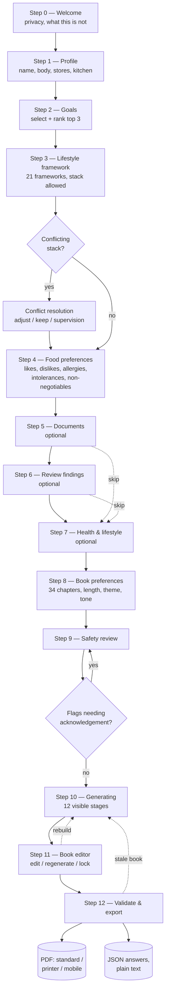

# LifePrint — User Flow

Thirteen steps. Three are optional. One is a gate.

## Overview

## Step detail

| Step | Screen | Required to advance | Notes |
| --- | --- | --- | --- |
| 0 | Welcome | — | States plainly what the tool will not do; offers demo and hard-case loaders |
| 1 | Profile | First name; sane age/weight/household if entered | Units switchable (imperial/metric, lb/kg) |
| 2 | Goals | ≥1 goal; ranking when >1 | Ranking drives chapter emphasis and the book subtitle |
| 3 | Lifestyle framework | ≥1 framework; text for custom/clinician options | Shows what the stack removes and how many of 284 foods survive |
| 4 | Food preferences | Every free-text restriction tagged with a category | Allergy vs intolerance vs preference are separate fields on purpose |
| 5 | Documents *(optional)* | — | Paste, `.txt`/`.md`, or PDF text layer. Sample report downloadable |
| 6 | Review findings *(optional)* | Soft warning if findings are unconfirmed | Confirm / downgrade / delete each hit; nothing is used unconfirmed |
| 7 | Health & lifestyle *(optional)* | — | Conditions, medications, pregnancy, sleep, stress, training |
| 8 | Book preferences | ≥3 chapters enabled | Length 15/30/60/100, 11 themes, tone, title/subtitle |
| 9 | Safety review | **All acknowledgement-required flags acknowledged** | Enforced in `validateStep(9)`; the default nav is hidden here |
| 10 | Generating | — | 12 stages with timings; auto-offers the editor |
| 11 | Book editor | — | Edit paragraph, regenerate paragraph/chapter, lock, remove chapter |
| 12 | Validate & export | — | 17 checks shown in full; failures require an explicit override to export |

## Navigation model

- **Rail (desktop) / progress bar + counter (mobile)** shows completion, which steps are optional, and
  which are visited.
- **Alt+←/Alt+→** move between steps; each move runs that step's validation.
- **"Book & data" menu** is reachable from every screen: JSON export/import, demo and hard-case
  loaders, version list, and a destructive reset behind a confirmation.
- **URL accelerators** (used by QA and useful for demos): `?scenario=demo`, `?scenario=hard`,
  `&step=N`.

## Re-entry and staleness

Answers autosave on every mutation. Reloading returns the user to their current step with everything
intact. If an answer changes after a book exists, the book is marked stale with the reason attached,
and both the editor and export screens display it until the user rebuilds. Rebuilding preserves
paragraph edits and regenerated variants; "fresh draft" discards them after a confirmation.

## Failure paths the flow handles

| Failure | Behaviour |
| --- | --- |
| pdf.js does not load | Upload still accepted for `.txt`/`.md`; PDF users are pointed to paste-the-text and manual entry |
| Scanned/image-only PDF | Detected as "no text layer", user told why, manual entry offered |
| jsPDF does not load | Export buttons explain the failure and point at browser print |
| `localStorage` write fails (private mode, quota) | Save failure is surfaced; JSON export is offered as the escape hatch |
| Framework stack leaves too few foods | Conflict screen fires with the surviving-food count before the user continues |
| Everything the user eats is excluded | Meal plan prints an honest shortfall callout instead of inventing food |
